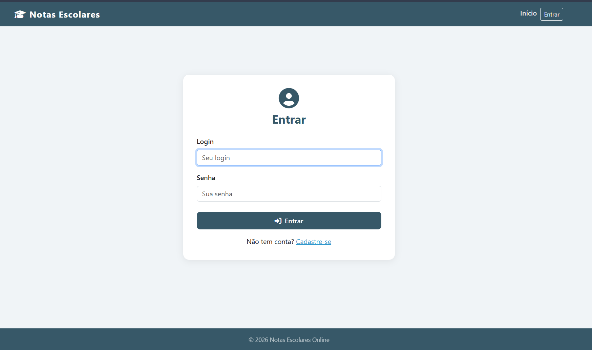
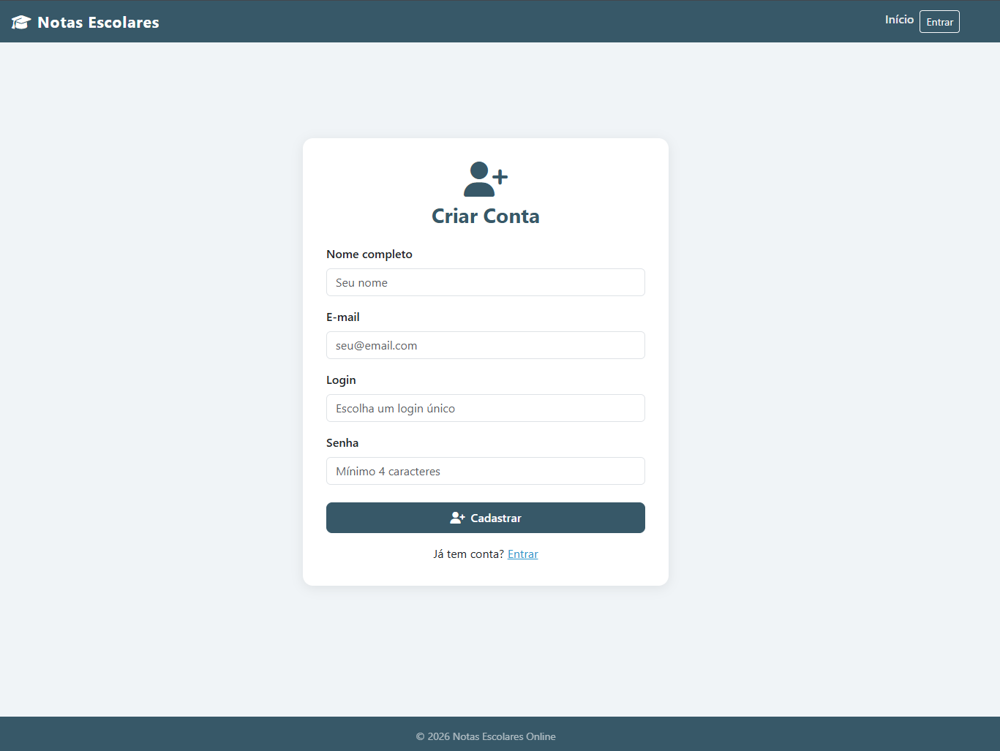
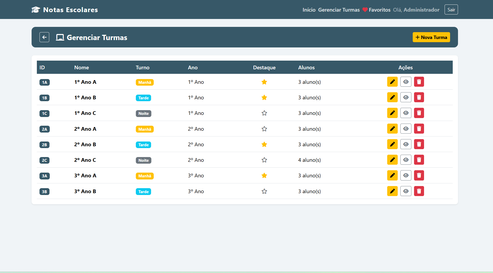
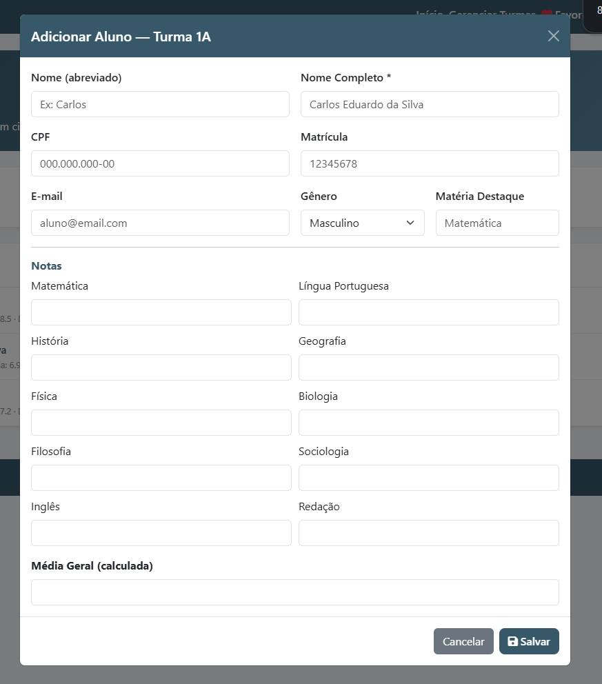
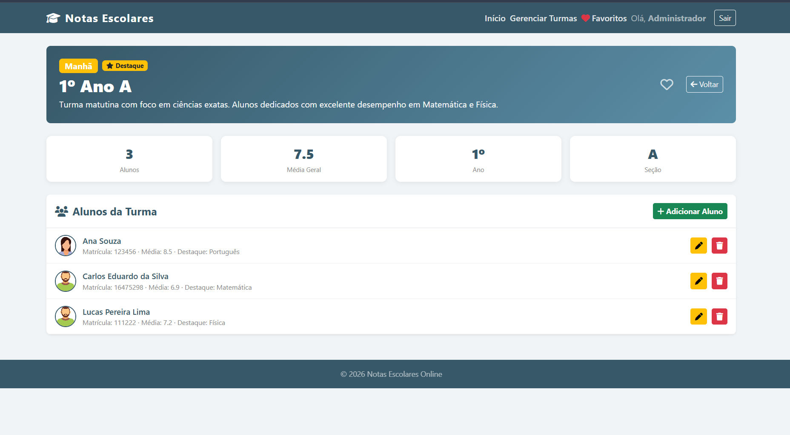
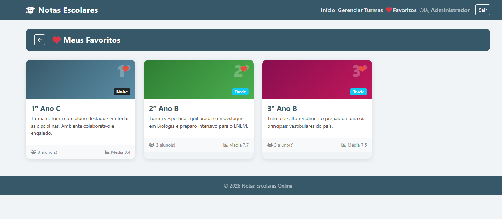

# Notas Escolares Online

Sistema web para gerenciamento de turmas e notas escolares, com autenticação de usuários, painel administrativo e funcionalidade de favoritos. Permite consultar, cadastrar, editar e excluir turmas e alunos, visualizando informações como notas por disciplina, média geral e matéria destaque.

---

## Funcionalidades

- **Login e cadastro de usuários** — autenticação com sessão mantida via `sessionStorage`
- **Controle de acesso por perfil** — menu e ações adaptados para usuário comum e administrador
- **Carrossel de turmas em destaque** — slider automático com as turmas marcadas como destaque
- **Listagem de turmas com pesquisa** — filtro em tempo real por nome ou descrição
- **Favoritos** — marque e visualize suas turmas favoritas (coração preenchido/vazio)
- **CRUD de turmas** — cadastre, edite, visualize e exclua turmas (somente admin)
- **CRUD de alunos** — adicione, edite e exclua alunos dentro de cada turma (somente admin)
- **Página de detalhes** — estatísticas da turma, lista de alunos com notas por disciplina
- **Design responsivo** — adaptado para desktop, tablet e dispositivos móveis

---

## Tecnologias Utilizadas

| Tecnologia | Uso |
|---|---|
| HTML5 | Estrutura das páginas |
| CSS3 | Estilização, Grid, Flexbox e responsividade |
| JavaScript (Vanilla) | Lógica de negócio, DOM, autenticação e persistência |
| Bootstrap 5.3 | Componentes de UI (navbar, cards, carousel, modais) |
| Font Awesome 6.5 | Ícones da interface |
| LocalStorage | Persistência de dados (usuários, turmas, alunos, favoritos) |
| SessionStorage | Controle da sessão do usuário logado |

---

## Demo

Acesse a versão hospedada em: **[https://notas-escolares-online.vercel.app/](https://notas-escolares-online.vercel.app/)**

---

## Como Usar

1. Clone o repositório:
   ```bash
   git clone https://github.com/BrunoFernandes1302/NotasEscolares-Online.git
   ```
2. Abra o arquivo `public/index.html` diretamente no navegador.

**Credenciais de acesso padrão:**

| Perfil | Login | Senha |
|---|---|---|
| Administrador | `admin` | `123` |
| Usuário comum | `professor` | `123` |

---

## Estrutura do Projeto

```
public/
├── index.html              # Home — carrossel, cards, pesquisa e autor
├── login.html              # Tela de login
├── cadastro_usuario.html   # Cadastro de novo usuário
├── cadastro_itens.html     # CRUD de turmas (admin)
├── detalhes.html           # Detalhes da turma e alunos
├── favoritos.html          # Turmas favoritas do usuário
├── assets/
│   ├── css/style.css       # Estilos globais
│   └── js/
│       ├── app.js          # Auth, DB, navbar e utilitários compartilhados
│       ├── dados.js        # Seed inicial do LocalStorage
│       ├── index.js        # Lógica da home (carrossel, cards, pesquisa)
│       ├── login.js        # Autenticação
│       ├── cadastro_usuario.js
│       ├── cadastro_itens.js
│       ├── detalhes.js     # Detalhes da turma e CRUD de alunos
│       └── favoritos.js    # Página de favoritos
└── imagens/                # Assets de imagem
```

---

## Capturas de Tela

### Home Page


### Login e Cadastro





### Painel Admin — Gerenciar Turmas



### Adicionar e Editar Aluno




### Visualizar Turma (Detalhes)



### Turmas Favoritas



---

## Autor

**Bruno Henrique Fernandes Jardim**  
Análise e Desenvolvimento de Sistemas — PUC Minas
