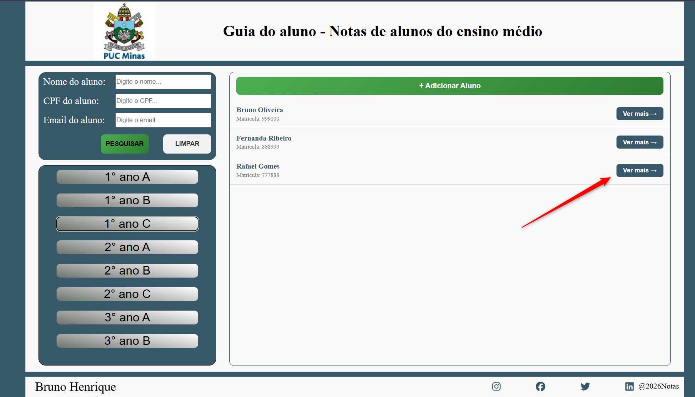
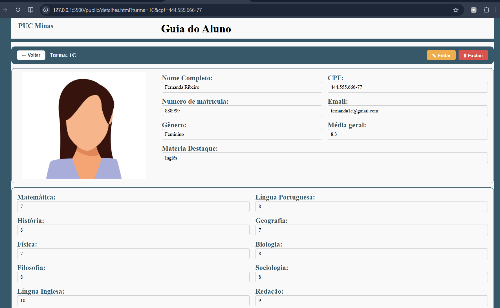
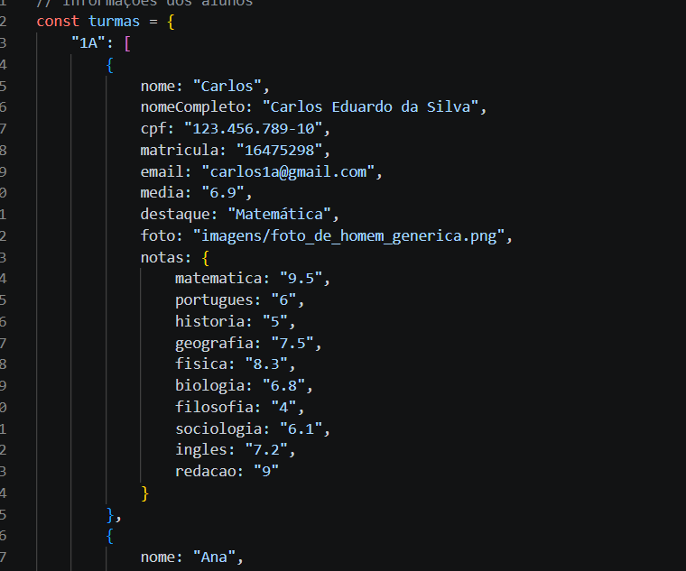

# Notas Escolares Online

Sistema web para gerenciamento de alunos e notas escolares, com interface intuitiva e responsiva. Permite consultar, cadastrar, editar e excluir alunos de múltiplas turmas, visualizando informações como notas por disciplina, média geral e matéria destaque.

---

## Funcionalidades

- **Listagem de turmas** — navegue entre as turmas do 1º ao 3º ano (A, B e C)
- **Busca avançada** — pesquise alunos por nome, CPF ou e-mail
- **Ficha completa do aluno** — foto, dados pessoais, notas por disciplina e média geral calculada automaticamente
- **Cadastro de alunos** — adicione novos alunos com upload de foto e seleção de turma
- **Edição de dados** — atualize informações pessoais e notas de qualquer aluno
- **Exclusão de alunos** — remova registros de turmas com confirmação
- **Design responsivo** — adaptado para desktop, tablet e dispositivos móveis

---

## Tecnologias Utilizadas

| Tecnologia | Uso |
|---|---|
| HTML5 | Estrutura das páginas |
| CSS3 | Estilização, Grid, Flexbox e responsividade |
| JavaScript (Vanilla) | Lógica de negócio, manipulação do DOM e busca |
| Font Awesome 6.5 | Ícones da interface |

> Sem dependências externas além do Font Awesome. Funciona diretamente no navegador, sem necessidade de servidor ou banco de dados.

---

## Como Usar

1. Clone o repositório:
   ```bash
   git clone https://github.com/BrunoFernandes1302/NotasEscolares-Online.git
   ```
2. Abra o arquivo `public/index.html` diretamente no navegador.

---

## Estrutura do Projeto

```
public/
├── index.html       # Página principal com listagem e busca
├── detalhes.html    # Página de detalhes e notas do aluno
├── script.js        # Lógica da aplicação
├── style.css        # Estilos globais
└── imagens/         # Assets de imagem
```

---

## Capturas de Tela







---

## Autor

**Bruno Henrique Fernandes Jardim**
